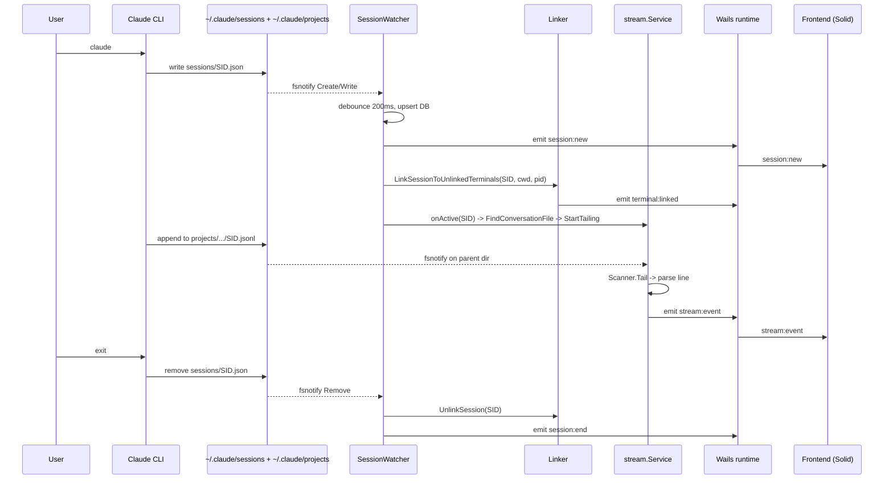

<!-- Author: Subash karki -->

# AI Engine

## 1. Overview

The Phantom AI engine watches the on-disk artifacts that AI coding CLIs (Claude Code, OpenAI Codex) write to `~/.claude/` and `~/.codex/`, normalizes them through a single `Provider` interface, and pushes typed events to the Solid.js frontend over Wails. It does not call the Anthropic API or Codex API directly for session data — every read is a filesystem operation against the CLI's own storage. The chat feature in `internal/chat/` does spawn the local `claude` CLI for streamed completions, but that is a separate subsystem from the session/streaming pipeline.

## 2. Provider system

The provider package decomposes an AI tool integration into six small interfaces (`internal/provider/provider.go:141-194`) — `ProviderIdentity`, `SessionDiscoverer`, `ConversationParser`, `CostCalculator`, `CommandRunner`, `PathResolver` — composed into `Provider` (`internal/provider/provider.go:204-215`). All shared shapes (`RawSession`, `Message`, `TokenUsage`, `HealthStatus`) live in the same file.

### 3-tier config loading

`Registry.LoadAll` (`internal/provider/registry.go:238-263`) loads configs in priority order:

1. Embedded YAML compiled into the binary via `internal/provider/embed.go` and `LoadFromEmbed` (`registry.go:89-127`). Errors here are fatal.
2. User overrides from `~/.phantom-os/providers/` via `LoadOverrides` (`registry.go:271-330`). Each override is deep-merged onto its matching builtin (`MergeConfigs`); parse or validation errors are logged and skipped.
3. Custom providers from `~/.phantom-os/providers/custom/` via `LoadFromDir` (`registry.go:51-86`). Errors are logged and skipped.

Both user directories are pre-created at boot by `EnsureConfigDir` (`internal/provider/init.go:19-32`).

### Registry, factories, instantiation

`Registry` (`internal/provider/registry.go:32-46`) holds three maps: `providers`, `configs`, `factories`. Go adapters self-register via `RegisterAdapterFactory(goPackage, fn)` (`registry.go:223-230`); `main.go:100-105` does this for `claude` and `codex`. After `LoadAll`, `InstantiateAll` (`registry.go:367-377`) walks every loaded config, looks up its `adapter.go_package`, and replaces the generic `ConfigProvider` with the adapter-built `Provider`. Configs without a registered factory keep the YAML-only `ConfigProvider`.

### Active provider selection

`main.go:115-126` picks the active provider with a hardcoded preference: `claude` if registered, otherwise the first entry from `Registry.Enabled()` (which filters to `Enabled() && IsInstalled()` in `registry.go:156-167`). If nothing is available the process exits.

## 3. Adapters

### Claude (`internal/provider/claude/claude.go`)

`ClaudeProvider` embeds `*provider.ConfigProvider` (`claude.go:27-34`) and overrides only what config cannot express:

- `FindConversationFile` (`claude.go:49-98`) implements Claude's encoded-path convention: `~/.claude/projects/<cwd-with-/-replaced-by->/<sessionID>.jsonl`. With an empty `cwd` it falls back to `filepath.WalkDir` across the conversations root.
- `ParseConversation` reads JSONL with nested content blocks (text, `tool_use`, `thinking`).

Everything else (paths, sessions glob, cost rules, command templates) is driven by `internal/provider/configs/claude.yaml`.

### Codex (`internal/provider/codex/codex.go`)

`CodexProvider` overrides four methods (`codex.go:1-12`):

- `DiscoverSessions` (`codex.go:53-65`) uses a dual strategy — query `~/.codex/state_5.sqlite` first via `discoverFromSQLite`, then fall back to the JSONL index (`discoverFromJSONLIndex`, `codex.go:155+`) if SQLite fails.
- `FindConversationFile` walks Codex's date-nested layout (`YYYY/MM/DD/`).
- `ParseConversation` decodes the OpenAI event schema (`session_meta`, `event_msg`, `response_item`, `turn_context`).
- `ParseUsage` maps OpenAI token fields (`prompt_tokens`, `completion_tokens`, `total_tokens`) onto `TokenUsage`.

The boundary is consistent: anything that can be expressed as paths, globs, regex, or pricing tiers stays in YAML; anything that requires reading a foreign data structure (Claude's nested blocks, Codex's SQLite, Codex's event schema) lives in the adapter.

## 4. Session lifecycle

The collector registry (`internal/collector/registry.go:14-25`) manages five collectors that all implement `Collector` (`internal/collector/collector.go:10-14`). `main.go:146-180` wires them up; `Registry.StartAll` (`registry.go:35-88`) launches each in a goroutine with a 5-second startup timeout.

| Collector | File | What it does |
|---|---|---|
| `SessionWatcher` | `session_watcher.go:39-72` | fsnotify-watches `prov.SessionsDir()`, debounces writes 200ms, upserts sessions, runs a 5s stale detector and 10s context bridge |
| `JSONLScanner` | `jsonl_scanner.go:39-58` | Initial full scan of conversation JSONL, plus 60s periodic rescan for sessions still missing tokens (`rescanMaxAttempts = 20`, `jsonl_scanner.go:35`) and a 10s active-context poller |
| `ActivityPoller` | `activity_poller.go:61-70` | fsnotify on per-project directories; emits `EventActivity` batches as new lines append to JSONL |
| `TaskWatcher` | `task_watcher.go:51-66` | Watches `prov.TasksDir()` recursively (`addSubdirectories`, `task_watcher.go:130`), backfills session names |
| `TodoWatcher` | `todo_watcher.go:45-60` | Watches `prov.TodosDir()`, derives `sessionID` from filename (`extractSessionID`, `todo_watcher.go:132`) |
| `SessionEnricher` | `session_enricher.go:32-40` | Not in the registry — runs `StartPeriodicEnrichment` directly (`main.go:162`); also called inline by `SessionWatcher.handleRemove` (`session_watcher.go:447`) |

### Linker — terminal binding

`linker.Linker` (`internal/linker/linker.go:24-38`) couples terminal panes to AI sessions. `LinkSessionToUnlinkedTerminals` (`linker.go:105-168`) is invoked from `SessionWatcher` after a new active session is upserted (`session_watcher.go:415-419`). It filters by CWD overlap (`CWDsMatch`), then disambiguates with `IsDescendant` PID ancestry when multiple terminal candidates match (`linker.go:129-144`). The reverse direction — terminal-first — is `LinkTerminalToActiveSession` (`linker.go:43-101`), which falls back to most-recent on PID failure. `UnlinkSession` (`linker.go:203-227`) is called from `SessionWatcher.handleRemove` (`session_watcher.go:441`).

The collector→linker dependency is one-way; `SessionWatcher` references the linker through a local `terminalLinker` interface (`session_watcher.go:27-30`) to avoid an import cycle.

### Auto-tail flow

`main.go:191-213` builds the cross-cutting glue between `SessionWatcher` and `stream.Service`:

```
sessionWatcher.SetOnActive(fn)
  → activeProv.FindConversationFile(sessionID, "")
  → streamSvc.StartTailing(ctx, sessionID, jsonlPath)
```

`SetOnActive` (`session_watcher.go:78-80`) is fired from `processSessionFile` (`session_watcher.go:389-391`) whenever a session is upserted with `status == "active"`. The `tailedSessions` map in `main.go:191-200` deduplicates so a single session is tailed exactly once across watcher restarts.

## 5. Streaming

`stream.Service` (`internal/stream/service.go:18-32`) wraps a `Store` (DB writer) and a `sync.Map` of active tailers keyed by `sessionID`. Two operations matter:

- `ParseSession` (`service.go:36-56`) — one-shot: `Scanner.ScanAll` reads the whole JSONL, batched into `Store.SaveBatch`, then a single `stream:batch` event.
- `StartTailing` (`service.go:61-103`) — spins up a producer goroutine running `Scanner.Tail` (`internal/stream/scanner.go:84-156`) and a consumer goroutine. The producer uses fsnotify on the parent directory (more reliable cross-platform than per-file, `scanner.go:102-108`) with debounce + 500ms ticker fallback (`scanner.go:110-155`); if fsnotify is unavailable it falls back to `tailPoll` (`scanner.go:97-99`, `scanner.go:176`). The consumer persists each event with `Store.SaveEvent`, optionally invokes the registered `EventHook`, then emits `stream:event`. `StartTailing` is idempotent: a `LoadOrStore` guard at `service.go:62-65` makes a second call for the same session a no-op.

### Event model

`stream.Event` (`internal/stream/event.go:18-54`) is a flat struct covering all event kinds via `EventType` (`event.go:6-16`): `thinking`, `tool_use`, `tool_result`, `assistant`, `user`, `error`, `system`. Token fields, model, file path, diff content, and `SeqNum` are inline. `Timeline` and `TimelinePoint` (`event.go:57-72`) provide the condensed view.

The parser (`internal/stream/parser.go`) supports both single-event (`ParseLine`, `parser.go:49`) and multi-event (`ParseLineMulti`, `parser.go:217`) extraction — needed because a single Claude assistant JSONL line can contain multiple content blocks (text + tool_use + thinking).

## 6. Chat service

`chat.Service` (`internal/chat/service.go:31-45`) is independent from the session/stream pipeline. It manages persistent conversations + messages in SQLite and streams replies by spawning the local `claude` CLI — not by hitting the Anthropic Messages API directly.

`SendMessage` (`service.go:189-237`) executes:

1. `exec.LookPath("claude")` (`service.go:195`); if missing, emit `chat:stream` error with install hint.
2. Persist user message (`SaveMessage`).
3. Build prompt from history (`buildPrompt`, `service.go:246`).
4. `streamFromClaude` (`service.go:282-369`) runs `claude -p <prompt> --output-format stream-json --verbose --model <m> --no-session-persistence --dangerously-skip-permissions --setting-sources ""` with `cmd.Dir` set to a fresh `os.MkdirTemp("", "phantom-chat-*")` — explicitly preventing CLAUDE.md / `.claude/` discovery from leaking workspace context (`service.go:297-304`).
5. Parse NDJSON from stdout, dispatch through `handleStreamEvent` (`service.go:381+`), accumulate text into `fullContent`.
6. Persist assistant message and emit `chat:stream` `done`.

Stream events (`internal/chat/types.go`): `delta`, `done`, `error`, `thinking`, `tool_use`.

## 7. Frontend integration

| Binding file (`frontend/src/core/bindings/`) | Wails methods exposed |
|---|---|
| `sessions.ts` | `GetSessions`, `GetActiveSessions`, `GetSession`, `GetSessionTasks`, `GetActivityLog`, `ParseSessionHistory`, `PauseSession`, `ResumeSession`, `KillSession` |
| `providers.ts` | `GetProviders`, `GetProviderDetail`, `SetProviderEnabled`, `SetActiveProvider`, `TestProvider`, `AutoDetectProviders`, `AddCustomProvider`, `RemoveCustomProvider`, `ResetProviderOverride`, `GetActiveProvider` |
| `chat.ts` | `GetConversations`, `CreateConversation`, `DeleteConversation`, `SendChatMessage`, `GetChatHistory` |
| `journal.ts` | session-derived daily aggregates produced by `SessionEnricher` |

All bindings call through `(window as any).go.app.App` — Wails' generated bridge.

### Wails events emitted by the AI engine

Constants in `internal/app/events.go` and `internal/collector/events.go`:

| Event | Source | Payload |
|---|---|---|
| `session:new` | `session_watcher.go:380` | `{sessionId, cwd, kind, status}` |
| `session:update` | `session_watcher.go:358,717` | `{sessionId, status, ...}` |
| `session:end` | `session_watcher.go:456` | `{sessionId, reason}` |
| `session:stale` | `session_watcher.go:544` | `{sessionId, ...}` |
| `session:context` | `session_watcher.go:678`, `jsonl_scanner.go:607` | session context-window stats |
| `activity` | `activity_poller.go:274` | `[]activityEvent` |
| `jsonl:rescan` | `jsonl_scanner.go:434` | `{sessionId, ...}` |
| `jsonl:scan-complete` | declared `events.go:15`, `app/events.go:26` | scan summary |
| `task:new` | `task_watcher.go:247`, `todo_watcher.go:203` | `{sessionId, taskId, ...}` |
| `task:update` | `task_watcher.go:271`, `todo_watcher.go:223,262` | `{sessionId, taskId, ...}` |
| `terminal:linked` | `linker.go:95,162` | `{paneId, sessionId}` |
| `terminal:unlinked` | `linker.go:193,221` | `{paneId, sessionId}` |
| `stream:batch` | `stream/service.go:50` | `{session_id, count}` |
| `stream:event` | `stream/service.go:89` | `Event` |
| `chat:stream` | `chat/service.go:197,220,234,396+` | `StreamEvent` |
| `journal:eod-trigger` | `session_watcher.go:738` | nil |

`app.EmitEvent` (`internal/app/events.go:54-56`) is a one-line wrapper around `wailsRuntime.EventsEmit`. Every collector receives `func(string, interface{})` closures from `main.go` so they never import Wails directly.

The Solid.js consumers live under `frontend/src/core/` (signals + types) and `frontend/src/features/` — out of scope for this document.

## 8. Data flow



## 9. File map

| Concern | Path | Role |
|---|---|---|
| Provider interface | `internal/provider/provider.go` | Six focused interfaces composed into `Provider`; normalized data types |
| Config-driven default | `internal/provider/config_provider.go` | Generic `ConfigProvider` that satisfies `Provider` from YAML alone |
| Registry + 3-tier load | `internal/provider/registry.go` | `LoadFromEmbed`, `LoadOverrides`, `LoadFromDir`, `InstantiateAll`, factories |
| Embedded configs | `internal/provider/embed.go`, `internal/provider/configs/*.yaml` | `claude.yaml`, `codex.yaml`, `gemini.yaml` |
| Boot config dirs | `internal/provider/init.go` | `EnsureConfigDir` |
| Claude adapter | `internal/provider/claude/claude.go` | Encoded-path JSONL discovery, nested-block parser |
| Codex adapter | `internal/provider/codex/codex.go` | SQLite + JSONL-index discovery, OpenAI event parser |
| Wiring | `main.go` | Adapter factories, `LoadAll`/`InstantiateAll`, active selection, collector wiring, auto-tail glue |
| Collector interface | `internal/collector/collector.go` | `Name()/Start()/Stop()` |
| Collector registry | `internal/collector/registry.go` | Lifecycle manager with 5s startup timeout, reverse-order shutdown |
| Session lifecycle | `internal/collector/session_watcher.go` | fsnotify on sessions dir, stale detection, journal hooks |
| Conversation enrichment | `internal/collector/jsonl_scanner.go` | Token/cost computation, periodic rescan, active context polling |
| Activity events | `internal/collector/activity_poller.go` | Per-project JSONL deltas |
| Tasks/todos | `internal/collector/task_watcher.go`, `internal/collector/todo_watcher.go` | Watch `tasks/` and `todos/` dirs |
| Session post-processing | `internal/collector/session_enricher.go` | Summary, files-touched, git stats, daily aggregates |
| Backfill | `internal/collector/backfill.go` | One-shot `BackfillJournal` for `--backfill-journal` mode (`main.go:38-44`) |
| Collector events | `internal/collector/events.go` | Event-name constants |
| App-level events | `internal/app/events.go` | Wails event constants + `EmitEvent` wrapper |
| Terminal binding | `internal/linker/linker.go` | CWD overlap + PID ancestry, link/unlink |
| Linker helpers | `internal/linker/cwd.go`, `internal/linker/pid.go` | `CWDsMatch`, `IsDescendant` |
| Stream coordination | `internal/stream/service.go` | `ParseSession`, `StartTailing`, `StopTailing`, `EventHook` |
| JSONL scanning | `internal/stream/scanner.go` | `ScanAll`, `ScanFrom`, `Tail` (fsnotify + poll fallback) |
| JSONL parsing | `internal/stream/parser.go` | `ParseLine`, `ParseLineMulti` |
| Stream events | `internal/stream/event.go` | `Event`, `EventType`, `Timeline` |
| Persistence | `internal/stream/store.go` | `SaveEvent`, `SaveBatch`, `GetEvents`, `GetTimeline` |
| Chat (CLI-spawn) | `internal/chat/service.go`, `internal/chat/types.go` | Conversations + `claude` CLI streaming |
| Frontend bindings | `frontend/src/core/bindings/sessions.ts`, `providers.ts`, `chat.ts`, `journal.ts` | Typed Wails RPC wrappers |
| Strategy: direct | `internal/ai/strategies/direct.go` | Direct strategy with ambiguity penalty |
| Strategy: debate | `internal/ai/strategies/debate.go` | Debate strategy with ambiguity-aware activation |
| Symbol inference | `internal/composer/service.go` | `InferFilesFromPrompt` identifier extraction + resolution |
| Confidence decay | `internal/ai/knowledge/decisions.go` | `DecayConfig`, exponential decay on `GetSuccessRate`/`GetFailedApproaches` |
| Haiku consolidation | `internal/ai/knowledge/haiku_client.go` | LLM-powered pattern consolidation via Anthropic Messages API |
| Pattern compactor | `internal/ai/knowledge/compactor.go` | Semantic clustering + consolidation orchestration |
| Session memory | `internal/composer/session_memory.go` | `SessionMemoryBuilder`, 4KB tiered `<phantom-memory>` XML |
| Playground binding | `internal/app/bindings_playground.go` | `PlaygroundProcess` dry-run orchestrator pipeline |
| Playground UI | `frontend/src/components/panes/PlaygroundPane.tsx` | Playground pane with live results + alternatives table |
| Crash recovery (persist) | `internal/composer/persist.go` | `ReapInterruptedTurns`, `ClearInterruptedFlag` |
| Crash recovery (bindings) | `internal/app/bindings_session_ctrl.go` | Session resume/interrupt bindings |
| File graph extensions | `internal/ai/graph/filegraph/graph.go` | `SymbolLookupFold`, `SymbolUsageLookup`, `WalkNodes` |
| Embedding interface | `internal/ai/embedding/embedding.go` | `Embedder` interface, `StubEmbedder`, `Normalize` |
| ONNX embedder | `internal/ai/embedding/onnx_embedder.go` | Native ONNX Runtime + tokenizer implementation |
| Embedder factory | `internal/ai/embedding/factory.go` | `NewEmbedder` auto-detection, `FindORTLibrary` |
| Vector store | `internal/ai/embedding/store.go` | `VectorStore` with SQLite persistence + in-memory index |
| Similarity search | `internal/ai/embedding/similarity.go` | `CosineSimilarity`, `TopK` |
| Model download | `internal/ai/embedding/model.go` | `EnsureModel`, `ModelExists`, HuggingFace URLs |
| ONNX setup | `internal/ai/embedding/setup.go` | `EnsureAll`, `EnsureRuntime`, `CheckSetup` |
| Memory extractor | `internal/ai/extractor/extractor.go` | `MemoryExtractor`, `Extract`, `Store` |
| Extraction types | `internal/ai/extractor/types.go` | `ExtractionResult`, `FileEdit`, `ErrorEncounter`, `SessionProfile` |
| Accumulators | `internal/ai/extractor/accumulators.go` | 5 single-pass accumulators |
| Patterns | `internal/ai/extractor/patterns.go` | Regex patterns for error/command detection |
| Conflict tracker | `internal/conflict/tracker.go` | `Tracker`, `Session`, `Conflict`, `ConflictHandler` |
| Name generator | `internal/namegen/namegen.go` | `Generate`, `GenerateUnique`, 200+ Pokémon names |
| Phantom relay hook | `hooks/phantom-relay.js` | Real-time tool event capture + rich content parsing |
| ONNX setup CLI | `cmd/onnx-setup/main.go` | Developer convenience for ONNX download |

## 10. Embedding engine (`internal/ai/embedding/`)

The embedding engine provides local semantic vector search backed by ONNX Runtime and the all-MiniLM-L6-v2 sentence transformer model. It enables the AI engine to find contextually similar memories, decisions, and patterns without calling an external API.

### Architecture

```
Embedder interface                    VectorStore
┌─────────────────────┐              ┌────────────────────────────┐
│ Embed(text) → []f32 │              │ in-memory index (map[id]*M)│
│ EmbedBatch(texts)   │──embed──────▶│ SQLite persistence         │
│ Dimensions() → 384  │              │ FindSimilar(query, topK)   │
│ Close()             │              │ StoreWithTTL(type, id, txt)│
└─────────────────────┘              │ PruneExpired()             │
        ▲                            │ RebuildIndex()             │
        │                            └────────────────────────────┘
┌───────┴───────────┐
│ ONNXEmbedder      │ ← native runtime + tokenizer
│ StubEmbedder      │ ← graceful fallback (returns ErrONNXNotAvailable)
└───────────────────┘
```

### Key types

| Type | File | Purpose |
|---|---|---|
| `Embedder` | `embedding.go` | Interface: `Embed`, `EmbedBatch`, `Dimensions`, `Close` |
| `ONNXEmbedder` | `onnx_embedder.go` | Real implementation using ONNX Runtime + tokenizer |
| `StubEmbedder` | `embedding.go` | No-op fallback for builds without ONNX |
| `VectorStore` | `store.go` | In-memory cosine index + SQLite persistence |
| `Memory` | `store.go` | Stored embedding with type, source, text, vector, TTL |
| `ScoredVector` | `similarity.go` | Candidate with cosine similarity score |

### Similarity search

`CosineSimilarity(a, b)` computes the cosine of the angle between two 384-dimensional vectors. `TopK(query, candidates, k)` returns the top-K results sorted by descending similarity. Both are brute-force linear scans — fast enough for the expected corpus size (thousands, not millions).

### VectorStore lifecycle

1. `NewVectorStore(db, embedder)` ensures the `ai_embeddings` schema and loads all rows into the in-memory index.
2. `Store(type, sourceID, text)` embeds text via the `Embedder`, upserts into SQLite, and updates the in-memory index. If embedding fails, stores the row with a nil vector (text-only fallback).
3. `StoreWithTTL(type, sourceID, text, ttl)` — same as `Store` but sets an `expires_at` timestamp.
4. `FindSimilar(query, topK, types...)` embeds the query, filters by optional type + TTL expiry, and returns top-K by cosine similarity.
5. `PruneExpired()` deletes rows past their TTL from both SQLite and the index.
6. `RebuildIndex()` drops the in-memory index and reloads from SQLite.

### Factory + auto-setup

`NewEmbedder()` (`factory.go`) probes for the ONNX runtime and model files. If both are present it returns an `ONNXEmbedder`; otherwise it returns a `StubEmbedder`. The system never fails at startup due to missing ONNX — it just degrades to text-only storage.

`EnsureAll()` (`setup.go`) downloads the ONNX Runtime v1.25.0 from GitHub Releases (~35MB) and the model from HuggingFace (~87MB) to `~/.phantom-os/lib/` and `~/.phantom-os/models/all-MiniLM-L6-v2/`. Downloads are atomic (temp file + rename) and idempotent.

### SQLite schema (migration 012)

```sql
CREATE TABLE ai_embeddings (
    id TEXT PRIMARY KEY,
    memory_type TEXT NOT NULL,
    source_id TEXT NOT NULL,
    text_content TEXT NOT NULL,
    vector BLOB NOT NULL,        -- 384 x float32 = 1536 bytes
    created_at DATETIME DEFAULT CURRENT_TIMESTAMP,
    expires_at DATETIME,
    UNIQUE(memory_type, source_id)
);
```

## 11. Memory extraction (`internal/ai/extractor/`)

The memory extractor processes session event streams into structured signals and persists them as vector-embedded memories. It runs a single pass over all events, driving 5 accumulators simultaneously.

### Accumulators

| Accumulator | Signal | What it tracks |
|---|---|---|
| `FileEditAccumulator` | `FilesSummary` | Files edited/written, edit counts per file |
| `ErrorAccumulator` | `ErrorsSummary` | Build/runtime/test/panic/import errors, resolution status |
| `CommandAccumulator` | `CommandsSummary` | Shell commands, patterns, exit codes, retries |
| `SatisfactionAccumulator` | `OutcomeSummary` | User satisfaction score (0.0-1.0), detected signals |
| `ProfileAccumulator` | `SessionProfile` | Session classification: `quick_fix`, `deep_refactor`, `exploration`, `debugging`, `deployment` |

### Extraction flow

```
stream.Event[] → Extract(sessionID, events) → ExtractionResult
                                                 ├── Files ([]FileEdit, TotalEdits)
                                                 ├── Errors ([]ErrorEncounter, Resolved, Total)
                                                 ├── Commands ([]CommandRun, UniquePatterns, RetryCount)
                                                 ├── Outcome (Score 0-1, Signals[])
                                                 └── Profile (Type, TurnCount, ToolCallCount, DurationMins)
```

### Storage with TTLs

`Store(ctx, result)` persists each signal category into VectorStore with different TTLs:

| Memory type | TTL | Rationale |
|---|---|---|
| `session_files` | 90 days | Recent file context is useful for strategy selection |
| `session_errors` | 180 days | Error patterns persist longer (debugging history) |
| `session_outcome` | 90 days | Satisfaction trends |
| `session_commands` | 60 days | Command patterns are more ephemeral |

Errors are stored individually (one entry per error) for granular similarity search. Files, commands, and outcomes are stored as per-session summaries.

### Integration

The extractor is invoked by the `SessionEnricher` after a session ends. The enricher passes the session's event stream through `Extract()`, then `Store()` to persist into VectorStore. The extraction offset (migration 013) tracks which events have already been processed, enabling incremental extraction for long-running sessions.

## 12. Conflict detection (`internal/conflict/`)

The conflict tracker monitors active editing sessions and detects when multiple sessions target the same git repository or edit the same files.

### Tracker API

```go
tracker := conflict.NewTracker(logger)

// Register handlers — called synchronously on detection
tracker.OnConflict(func(c conflict.Conflict) {
    // Emit UI warning, adjust AI risk, log for audit
})

// Register a session
tracker.Register(conflict.Session{
    ID: paneID, SessionID: dbID, Name: "Charizard",
    Source: "composer", RepoCWD: "/path/to/repo",
})

// Track file edits
tracker.RegisterFile(paneID, "internal/app/main.go")

// Query
conflicts := tracker.GetConflicts(paneID)
sessions := tracker.GetActiveSessions("/path/to/repo")
stats := tracker.Stats()

// Cleanup
tracker.Unregister(paneID)
```

### Conflict types

| Type | Detection | Example |
|---|---|---|
| `repo` | Two sessions have CWDs resolving to the same `git rev-parse --show-toplevel` | Composer + Terminal both editing `phantom-os/v2` |
| `file` | Two sessions register edits to the same file path | Both sessions editing `main.go` |

### Consumers

- **Composer** — emits amber banner UI warning when sessions overlap
- **AI Engine** — factors conflict state into strategy selection (increased risk assessment)
- **MCP Server** — exposes conflict status as a tool for Claude Code
- **Safety/Wards** — can block edits when conflicts are detected

### Design

- CWD overlap uses `linker.CWDsMatch` (segment-level path matching, same as terminal binding).
- Repo root resolution shells out to `git rev-parse --show-toplevel` with result caching (`repoRoots` map).
- Resolver is injectable via `WithRepoRootResolver` option (tests use a stub).
- All operations are concurrent-safe (`sync.RWMutex`).
- Handlers are called synchronously in registration order — keep them fast.

## 13. Pokémon session names (`internal/namegen/`)

Sessions get memorable names instead of UUIDs. `Generate()` picks a random name from a pool of 200+ Gen 1-3 Pokémon (Bulbasaur through Jirachi) and returns it in Title case. `GenerateUnique(existing)` retries up to 50 times to avoid collisions; if all collide, appends a numeric suffix ("Pikachu-7"). The Composer tab renames to show the Pokémon name on session start.

## 14. Phantom Relay hook (`hooks/phantom-relay.js`)

A PostToolUse + Stop hook that relays all Claude Code tool events to Phantom in real-time. Fire-and-forget POST to `localhost:3849/api/hooks/relay` using raw `http.request` (~1ms overhead). Parses rich tool details:

| Tool | Parsed fields |
|---|---|
| Edit/MultiEdit | `file_path`, `old_string`, `new_string`, `lines_removed`, `lines_added` |
| Write | `file_path`, `content_length`, `preview` |
| Bash | `command`, `exit_code`, `stdout`, `stderr` |
| Read | `file_path` |
| Grep/Glob | `pattern` |

Disable with `PHANTOM_HOOK_DISABLE=1`. Reports health to `/api/hook-health/report`.

## 15. Strategy selection — Ambiguity awareness

The orchestrator's strategy selector now accounts for prompt ambiguity when routing between direct and debate strategies.

### Ambiguity detection

`IsAmbiguous` is set by scanning the prompt for hedging signals: `"should"`, `"maybe"`, `"perhaps"`, `"not sure"`, `"which is better"`, and question marks. A numeric `AmbiguityScore` (0.0–1.0) captures how strongly ambiguous the prompt is.

### Direct strategy penalty (`internal/ai/strategies/direct.go`)

When `IsAmbiguous` is true, the direct strategy's confidence score is **penalized by 50%**. This prevents the orchestrator from confidently picking a single-shot approach for prompts where the user's intent is unclear.

### Debate strategy activation (`internal/ai/strategies/debate.go`)

The debate strategy lowers its activation threshold based on ambiguity severity:

| Ambiguity level | `AmbiguityScore` | Activation threshold |
|---|---|---|
| Strong | > 0.3 | 0.85 |
| Mild | ≤ 0.3, `IsAmbiguous` true | 0.70 |
| None | `IsAmbiguous` false | Default |

This ensures ambiguous prompts are routed through multi-perspective debate rather than a single direct pass.

## 16. Symbol inference (`internal/composer/service.go`)

`InferFilesFromPrompt` extracts code identifiers from the user's prompt text and resolves them to files in the project's source tree. This bridges the gap between natural-language references ("refactor czBadge") and concrete file paths.

### Extraction

PascalCase and camelCase identifiers are extracted from the prompt via regex. Short identifiers (< 3 chars) and common English words are filtered out.

### Resolution — two phases

1. **Graph symbol lookup** — `SymbolLookupFold` (`internal/ai/graph/filegraph/graph.go`) performs case-insensitive symbol search against the file graph's symbol index. This catches files that declare the symbol.
2. **Grep fallback** — For symbols not found in the graph (barrel re-exports, dynamic imports), the resolver greps the source tree for the identifier and collects consumer files.

### Example

Prompt: `"refactor czBadge"`
- Extracted identifier: `czBadge`
- Phase 1 (graph): finds `CZBadge.tsx`, `czBadge.recipe.ts`, etc.
- Phase 2 (grep): finds 72 files importing/using the symbol, `blast_radius=29`

## 17. Confidence decay (`internal/ai/knowledge/decisions.go`)

The `DecisionStore` applies **exponential decay** at query time so recent decisions carry more weight than stale ones.

### Decay formula

```
weight = exp(-ln(2) × age_days / half_life)
```

### Asymmetric half-lives (`DecayConfig`)

| Decision type | Half-life | Rationale |
|---|---|---|
| Success | 30 days | Fast decay — stays open to alternatives as codebase evolves |
| Failure | 90 days | Slow decay — remembers mistakes longer to avoid repeating them |

### Application

- `GetSuccessRate` weights each historical outcome by its decay factor before computing the ratio.
- `GetFailedApproaches` filters out failures whose decayed weight drops below a threshold, effectively forgetting ancient mistakes while preserving recent ones.

## 18. LLM-powered pattern consolidation (`internal/ai/knowledge/`)

When the decision store accumulates enough similar entries, the system uses Claude Haiku to consolidate them into higher-level patterns.

### Clustering (`internal/ai/knowledge/compactor.go`)

Similar decisions are clustered via `VectorStore.FindSimilar` with cosine similarity > 0.85. Only clusters with 3+ members are candidates for consolidation.

### Consolidation (`internal/ai/knowledge/haiku_client.go`)

`HaikuClient` calls the Anthropic Messages API with the cluster's decisions and asks for a consolidated pattern.

**Limits:**
- 10 clusters per run
- 120-second cooldown between runs

**Output:** `ConsolidatedPattern` containing:
- `strategy` — which orchestrator strategy works best
- `description` — human-readable pattern summary
- `conditions` — when the pattern applies
- `failure_modes` — known failure modes and mitigations
- `confidence` — aggregate confidence score

### Audit trail

Every consolidation is logged in the `ai_consolidation_log` SQLite table with:
- Input/output token counts
- USD cost per cluster
- Timestamp and cluster metadata

**Cost:** ~$0.0014/cluster, ~$3/month ceiling at typical usage.

## 19. Session-start memory injection (`internal/composer/session_memory.go`)

`SessionMemoryBuilder` assembles a compact `<phantom-memory>` XML block (4KB budget) that is injected into the first turn of a new session, giving the AI immediate context about the codebase and past decisions.

### Tiered sections

Sections are prioritized and serialized in order. Lower-priority sections are dropped first when the 4KB budget is tight.

| Section | Priority | Content |
|---|---|---|
| Graph Stats | 100 | File count, symbol count, edge density |
| Proven Patterns | 90 | Consolidated patterns from `DecisionStore` |
| Recent Failures | 80 | Decayed failure history (avoids repeating mistakes) |
| Cross-Project Patterns | 70 | Patterns from other repos that may transfer |
| Decision Summary | 60 | Aggregate success rates by strategy |

### Injection mechanism

- **New session:** Injected via `--append-system-prompt` on the first turn.
- **Resumed session:** `--resume` inherits the prompt from Claude's cache; no re-injection.
- Emits `memory_loaded` event to the frontend after injection.

## 20. AI Engine Playground (`internal/app/bindings_playground.go`)

A dry-run mode that executes the full orchestrator pipeline without spawning Claude or making any API calls.

### PlaygroundProcess binding

Runs the complete pipeline:
1. Resolve indexer
2. Infer files from prompt (`InferFilesFromPrompt`)
3. `orchestrator.Process` — strategy selection, scoring, alternatives
4. Build session memory (`SessionMemoryBuilder`)

### Return payload

| Field | Description |
|---|---|
| `strategy` | Selected orchestrator strategy |
| `alternatives` | Ranked alternative strategies with scores |
| `confidence` | Overall confidence score |
| `complexity` | Estimated task complexity |
| `risk` | Risk assessment |
| `blast_radius` | Number of files potentially affected |
| `inferred_files` | Files resolved from prompt identifiers |
| `enriched_prompt` | Prompt after symbol resolution and context injection |
| `session_memory` | The `<phantom-memory>` XML block that would be injected |
| `graph_stats` | Current file graph statistics |

**No API calls, no cost.** This is purely local computation against the graph, decision store, and vector store.

### Frontend

`PlaygroundPane` (`frontend/src/components/panes/PlaygroundPane.tsx`) renders:
- Live results as the pipeline executes
- Alternatives table with strategy names, scores, and reasoning
- Collapsible sections for session memory, enriched prompt, and graph stats

## 21. Crash recovery (`internal/composer/persist.go`, `internal/app/bindings_session_ctrl.go`)

Handles sessions that were interrupted by a crash, force-quit, or power loss.

### Schema (migration 015)

`composer_turns` table gains a `was_interrupted` boolean column.

### Boot-time reaping

`ReapInterruptedTurns()` runs at startup and marks all turns with `status = 'running'` as `was_interrupted = true`. These are orphaned turns from a previous process that never completed.

### Resume flow

- `ClearInterruptedFlag()` resets `was_interrupted` when the user resumes a session.
- The frontend shows an amber **"Resume?"** banner in the sidebar for sessions with interrupted turns.
- Per-session badge indicates crash state.

## 22. File graph enhancements (`internal/ai/graph/filegraph/graph.go`)

Three new graph traversal methods:

| Method | Purpose |
|---|---|
| `SymbolLookupFold` | Case-insensitive symbol search across all graph nodes. Used by `InferFilesFromPrompt` for phase-1 resolution. |
| `SymbolUsageLookup` | Finds files that **declare OR import** a given symbol. Broader than `SymbolLookupFold` which only checks declarations. |
| `WalkNodes` | Iterates all graph nodes with a read-only callback. Used for bulk operations (stats, export, validation). |

## 23. Gotchas

- **Hardcoded active provider preference.** `main.go:115-118` always picks Claude when registered, regardless of any "preferred provider" config. Selection only flips to Codex (or anything else) when Claude is absent.
- **Backfill is a separate process mode.** `--backfill-journal` (`main.go:38-44`, `main.go:70-77`) reuses the DB and journal but `os.Exit(0)`s before Wails starts. The `journalSvc` and DB are still constructed before this branch — order matters.
- **`SessionEnricher` is not in the registry.** It's started directly by `go enricher.StartPeriodicEnrichment(...)` (`main.go:162`) and also called inline from `SessionWatcher.handleRemove` (`session_watcher.go:447`). It does not implement `Collector`, so it has no `Stop()` and is not gracefully shut down by `Registry.StopAll`.
- **`Registry.StartAll` reports startup before `Start()` actually returns.** `collector/registry.go:53-65` signals success as soon as the goroutine begins executing, then calls `Start(ctx)` which is blocking. A collector that fails inside `Start` after the signal is logged but does not abort startup.
- **Override files for unknown providers are silently skipped.** `LoadOverrides` (`registry.go:305-309`) only merges onto an existing builtin. Dropping a YAML for a brand-new provider into `~/.phantom-os/providers/` (instead of `providers/custom/`) does nothing but emit a warning.
- **`Adapter.go_package` is the only registry key.** A YAML pointing at a `go_package` no factory has registered for silently falls back to `ConfigProvider` (`registry.go:343-345`). There is no error or warning, so adapter mismatches surface only as missing behavior at runtime.
- **`StartTailing` deduplicates by storing `nil` first.** `service.go:62-65` uses `LoadOrStore(sessionID, nil)`; the real `cancel` is stored a line later. A racing `StopTailing` between those two lines would no-op silently because the stored value is still `nil`.
- **Auto-tail dedup map (`tailedSessions`, `main.go:191`) is per-process.** A session that ends and immediately restarts with the same ID inside one run will not be re-tailed. App restart resets the map, so this only matters for long-lived sessions that recycle their ID.
- **Chat service runs the `claude` CLI in a fresh tempdir.** `service.go:299-304` deliberately points `cmd.Dir` at `os.MkdirTemp` so user CLAUDE.md / `.claude/` files do not leak. If `MkdirTemp` fails, `cmd.Dir` is left unset and the CLI inherits the Phantom process CWD instead — potentially loading Phantom's own project context.
- **fsnotify is best-effort.** `stream/scanner.go:97-99` and the activity poller silently fall back to polling when fsnotify is unavailable. Behavior is correct, but the latency floor jumps from milliseconds to `tailFallbackInterval` (500ms in scanner, 30s in `jsonl_scanner.activeContextFallbackInterval`).
- **Embedding degrades silently.** `NewEmbedder()` returns `StubEmbedder` if ONNX runtime or model files are missing — no error, just `ErrONNXNotAvailable` on every `Embed()` call. `VectorStore.Store` catches this and stores the row with a nil vector (text-only, excluded from similarity search). Check `StoreStats.EmbedderActive` to tell if real embeddings are running.
- **VectorStore index is fully in-memory.** All vectors are loaded from SQLite into a `map[string]*Memory` on startup. This is fine for thousands of entries but will need an HNSW index if the corpus grows to hundreds of thousands.
- **Conflict tracker repo root caching is per-Tracker lifetime.** `repoRoots` is never evicted. If a repo moves or a symlink changes during a session, the stale cache entry persists. App restart clears it.
- **Conflict handlers run synchronously.** `notifyHandlers` calls each handler in sequence. A slow handler blocks detection for subsequent registrations. Handlers that do I/O should spawn a goroutine internally.
- **Name collisions are probabilistic.** `GenerateUnique` retries 50 times, then falls back to numeric suffix. With 200+ names the collision probability is low, but it's not zero — especially for heavy multi-session users.
- **Phantom Relay is fire-and-forget.** `phantom-relay.js` swallows all HTTP errors. If Phantom is not running, tool events are silently lost. There is no queue or retry.
- **Ambiguity detection is keyword-based.** The ambiguity scanner uses a fixed set of hedging words ("should", "maybe", etc.) and question marks. Prompts that are semantically ambiguous but don't contain these signals will not trigger the penalty/threshold adjustments.
- **Symbol inference greps the full source tree in phase 2.** For large repos, the fallback grep can be slow. Phase 1 (graph lookup) is fast, but phase 2 shells out to `grep -rl` with no file-count cap.
- **Confidence decay is query-time only.** Decay factors are not persisted — they are recomputed on every `GetSuccessRate`/`GetFailedApproaches` call. This is correct but means the same query is more expensive than a simple lookup.
- **Haiku consolidation has a 120s cooldown.** Back-to-back calls within the cooldown window are silently skipped. The cooldown is per-process — app restart resets it.
- **Session memory is first-turn only.** The `<phantom-memory>` block is injected via `--append-system-prompt` on the first turn. If the first turn fails or is interrupted before the prompt is sent, the memory is lost for that session. `--resume` does not re-inject.
- **Playground does not spawn Claude.** `PlaygroundProcess` exercises the full pipeline but never calls the Anthropic API. Strategy scores may differ slightly from a real session if the strategy scorer has API-dependent branches (currently none, but future strategies could).
- **`ReapInterruptedTurns` is best-effort at boot.** If the DB is locked or corrupted at startup, orphaned turns remain unmarked. The frontend will not show the "Resume?" banner for those sessions.
- **`SymbolLookupFold` is case-insensitive but not fuzzy.** It folds to lowercase for comparison. `czBadge` matches `CZBadge` and `czbadge`, but `czBdge` (typo) does not match. No Levenshtein or edit-distance fallback.
